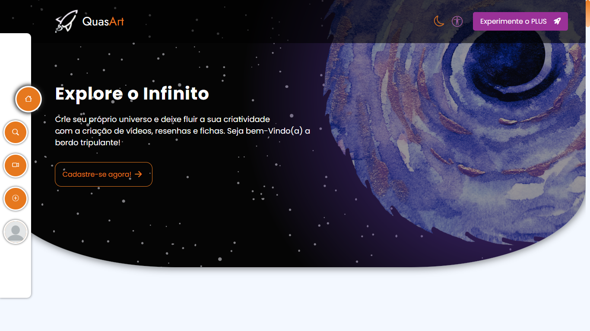
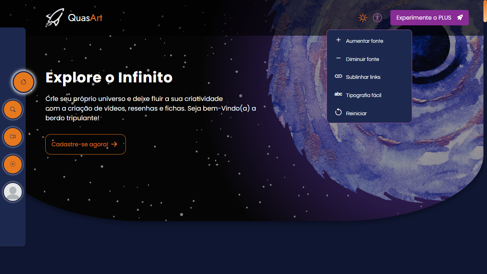
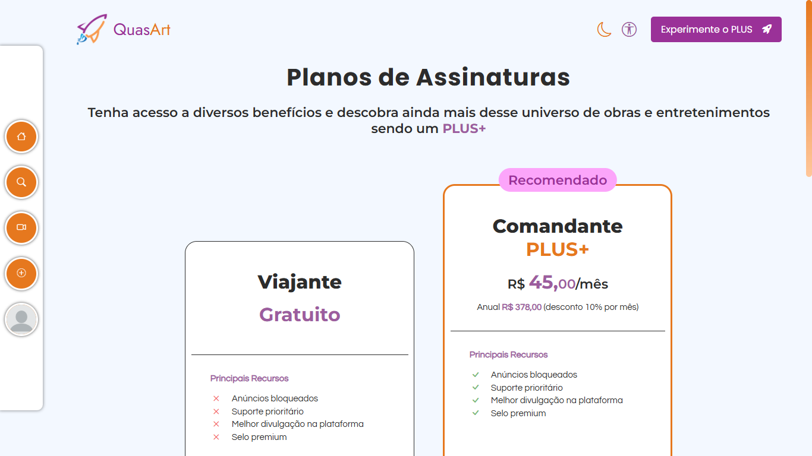
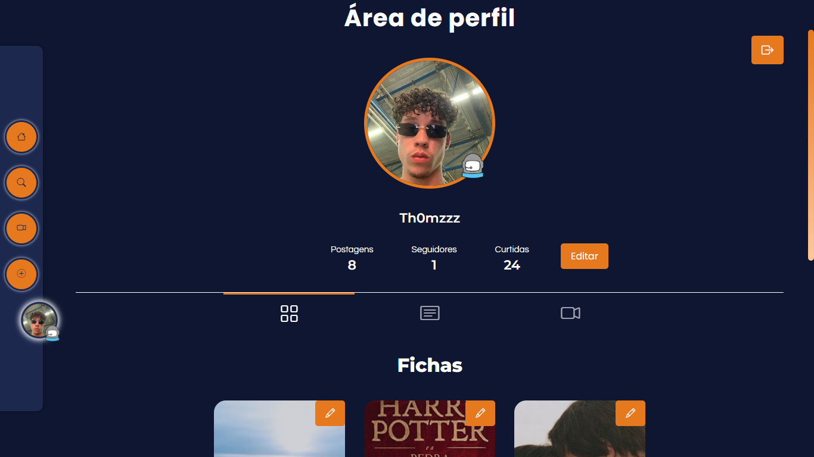
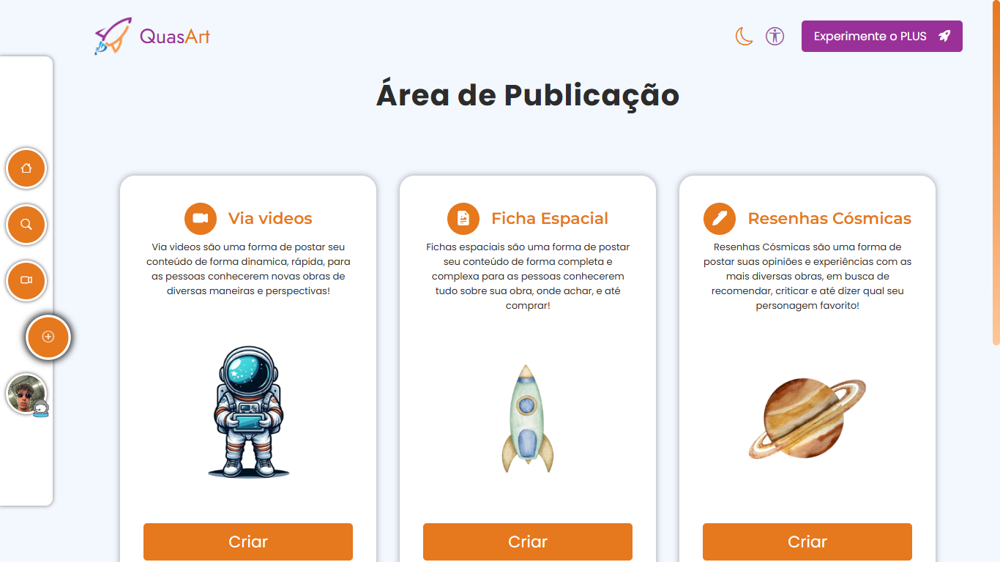
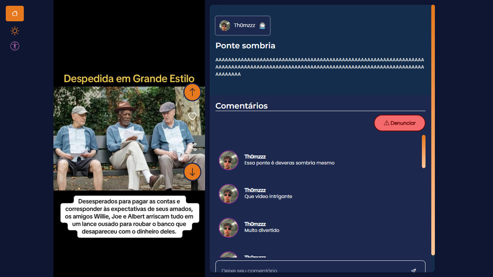
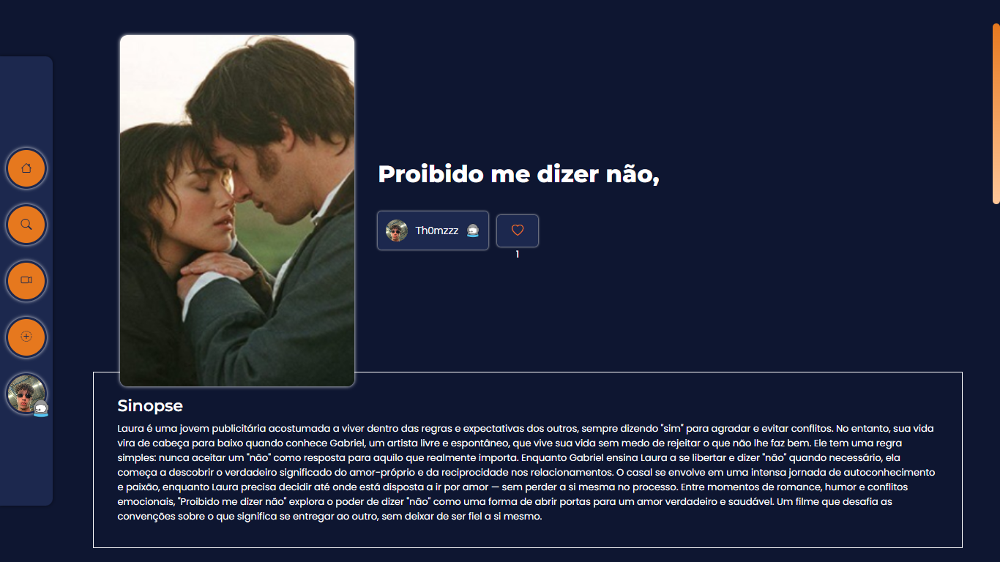
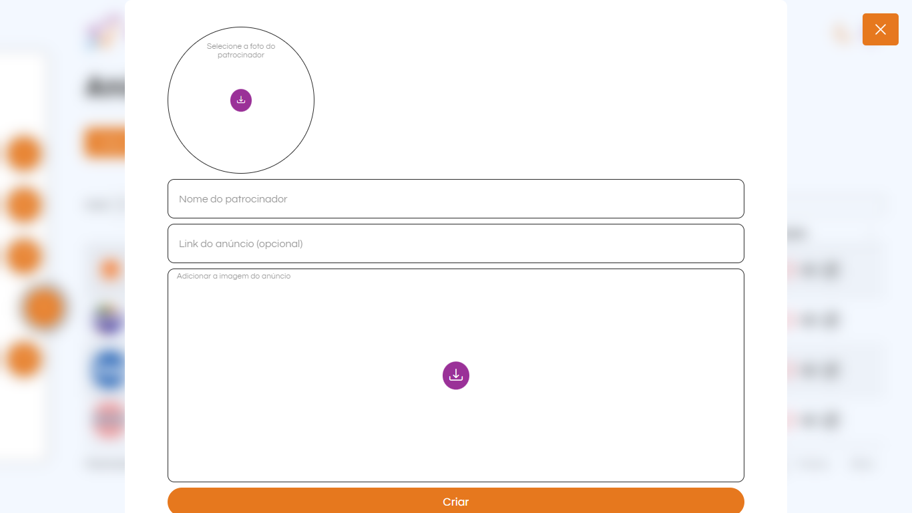
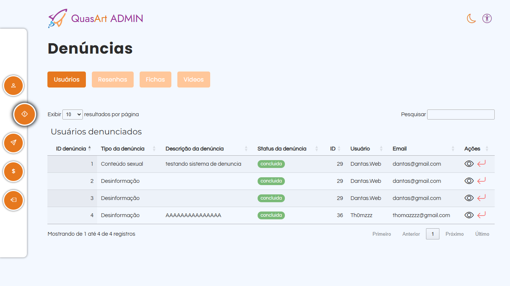
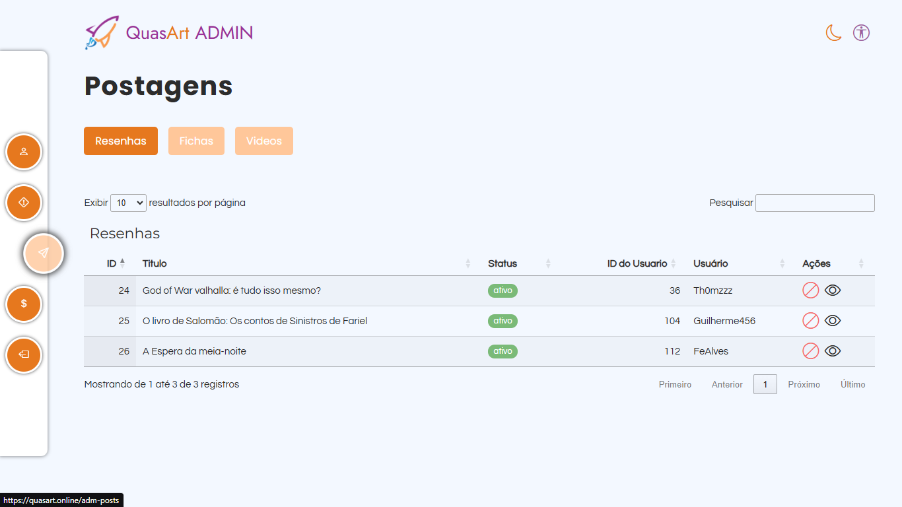

 
	

<a href="https://fiebedu.sharepoint.com/sites/Moonvies">
	               
</a>

## Sobre o Projeto

**Quasart** é uma plataforma web desenvolvida com o objetivo de reunir e divulgar informações sobre obras já existentes ou criações originais, como podcasts, livros, filmes, séries e jogos. Com uma temática espacial, destacada pelos tons **amarelos** e **roxos**, **Quasart** oferece uma experiência atraente e envolvente para seus usuários.

A aplicação foi construída seguindo os moldes da arquitetura **MVC** utilizando **Node.js**, **Express** e **EJS**, garantindo uma organização clara e uma navegação intuitiva.

## Funcionalidades Principais

- **Divulgação de Obras**: Permite cadastrar obras como podcasts, livros, filmes, séries ou jogos, a partir das resenhas, vídeos e fichas completas.
- **Sistema Social**:
  - Seguir e ser seguido por outros usuários.
  - Curtir e comentar em posts.
- **Publicação de Conteúdos**:
  - Resenhas detalhadas.
  - Vídeos e fichas completas com informações das obras.
- **Sistema de Administração**:
  - Gerenciamento de usuários, posts e denúncias.
  - Controle de anúncios.

## Tecnologias Utilizadas

- **Node.js**: Ambiente de execução JavaScript no lado do servidor.
- **Express**: Framework web para Node.js, utilizado para criação das rotas e manipulação de requisições.
- **EJS**: Motor de templates para renderização dinâmica de páginas HTML.
- **CSS**: Estilização personalizada para criar a temática espacial do projeto.

## Site

Você pode acessa-lo a partir: [https://quasart.onrender.com/](https://quasart.onrender.com/)

## Instalação e Execução

Siga as etapas abaixo para clonar e executar o projeto localmente:

1. Clone o repositório:

   ```bash
   git clone https://github.com/Th0mzzz/quasart.git
   ```

2. Acesse o diretório do projeto:

   ```bash
   cd quasart
   ```

3. Instale as dependências:

   ```bash
   npm install
   ```

4. Inicie o servidor:

   ```bash
   npm start
   ```

5. Abra o navegador e acesse [http://localhost:3000](http://localhost:3000).

## Prints do Projeto

1. **Página Inicial**: Visão geral da plataforma.
   <br>
   <br>
   <br>
	               
	               
	               
	               
   <br>
   <br>
   <br>
3. **Página de Cadastro de Obras**: Interface para adicionar novas obras.
   <br>
   <br>
   <br>
	               
	               
	
   <br>
   <br>
   <br>
4. **Feed Social**: Mostrando postagens, curtidas e comentários.
   <br>
   <br>
   <br>
	               
	                
	  
   <br>
   <br>
   <br>
5. **Painel de Administração**: Ferramentas para gerenciar usuários, posts e denúncias.

   <br>
   <br>
   <br>
	               
	                
	                
	                
	  
   <br>
   <br>
   <br>


## Equipe

Equipe 6 - Integrantes:
- Bruna Lopes Rodrigues N°3 RM86701
- Gabriela Dantas Figueiredo N°10 RM86623
- Nayara Santos N°27 RM86507
- Nicole Ribeiro N°28 RM88680
- Pedro Henrique N°29 RM86674
- Thomaz Vasconcelos Mendes N°35 RM86681
- Tifanny Iara N°36 RM86569

Desenvolvido com dedicação para o **Trabalho de Conclusão de Curso (TCC)**.

## Licença

Este projeto está licenciado sob a [MIT License](LICENSE).


